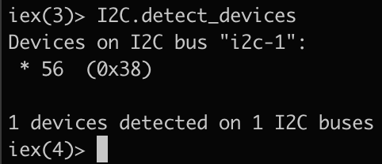
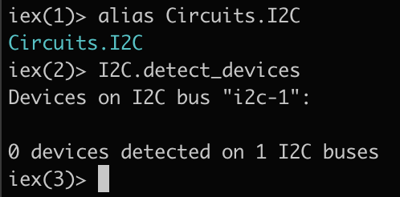

# Writing code

## Testing

It is common to want to verify that you have a working connection with the sensor. The Elixir [Circuits](https://elixir-circuits.github.io/) library is a handy abstraction for many common lower level communication protocols including [I2C](https://github.com/elixir-circuits/circuits_i2c) which is the protocol of choice for our AHT20 sensor. The `Circuits.I2C` library should already be included as a dependency so we can begin by probing the available devices:

```elixir
alias Circuits.I2C
I2C.detect_devices()
```

If you have correctly wired the sensor, you should see an output that shows a connected device and the device address:



If you have incorrectly wired the sensor, you will see an output that lists no devices detected:



With the detected device address you can attempt various commands that we will later use to command and read data from the sensor:

```elixir
{:ok, ref} = I2C.open("i2c-1")
I2C.write(ref, 0x38, <<0x01>>)
I2C.read(ref, 0x38, 1)
```

After succesfully connecting and communicating with the sensor, it is time to [review the datasheet](datasheet.md) to understand how we can have meaningful communication.

## Reading data

After reviewing the datasheet you should be ready to start implementing reading the sensor in code:

```elixir
I2C.write(ref, 0x38, <<0xBE>>)
I2C.write(ref, 0x38, <<0xAC, 0x33, 0x00>>)
{:ok, <<status, humidity::size(20), temperature::size(20), checksum>>} = I2C.read(ref, 0x38, 7)
```

Try to implement your sensor reading code as a module. After writing your new module, follow the process for building and burning a new firmware image and try to read the sensor data with your new module. Some techniques that may be useful during this portion are bitwise operations, Elixir bitstring parsing and pattern matching. You can [look here](../../lib/retreat_hack/temp_hum_sensor.ex) for an example if you are stuck. The above code was implemented in the form of a Genserver to help manage state (I2C pid) and to provide a clear public API for our sensor code. If you are unfamiliar with Elixir or Genservers then do not feel as though you need to attempt to implement any additional complexity related to Genservers or state management at this step.

Once you are succesfully sending commands and reading data from the sensor, please return to [the README](../../README.md) and follow the instructions to proceed to step 3.
